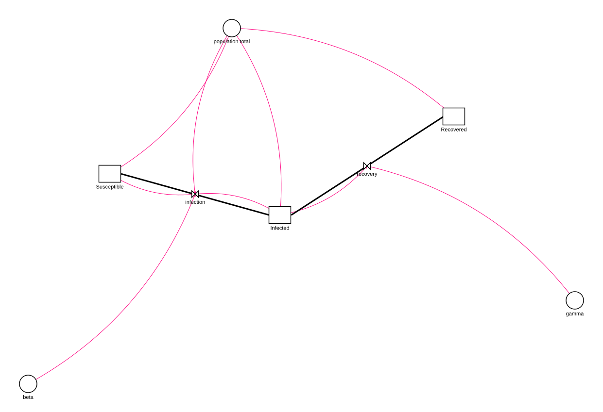

# Stella MCP Server

A [Model Context Protocol (MCP)](https://modelcontextprotocol.io/) server for creating and manipulating [Stella](https://www.iseesystems.com/store/products/stella-professional.aspx) system dynamics models. This enables AI assistants like Claude to programmatically build, read, validate, and save `.stmx` files in the XMILE format.

## What is this for?

**Stella** is a system dynamics modeling tool used for simulating complex systems in fields like ecology, biogeochemistry, economics, and engineering. This MCP server allows AI assistants to:

- **Create models from scratch** - Build stock-and-flow diagrams programmatically
- **Read existing models** - Parse and understand .stmx files
- **Validate models** - Check for errors like undefined variables or missing connections
- **Modify models** - Add stocks, flows, auxiliaries, and connectors
- **Save models** - Export valid XMILE files that open in Stella Professional

This is particularly useful for:
- Teaching system dynamics modeling
- Rapid prototyping of models through natural language
- Batch creation or modification of models
- Documenting and explaining existing models

## Installation

### From PyPI

```bash
pip install stella-mcp
```

### From source

```bash
git clone https://github.com/bradleylab/stella-mcp.git
cd stella-mcp
pip install -e .
```

### Requirements

- Python 3.10+
- `mcp>=1.0.0`

## Configuration

### Via uvx (no install required)

If you have [uv](https://docs.astral.sh/uv/) installed, the lowest-friction
configuration runs the published package directly:

```json
{
  "mcpServers": {
    "stella": {
      "command": "uvx",
      "args": ["stella-mcp"]
    }
  }
}
```

### Claude Desktop

Add to your `claude_desktop_config.json`:

```json
{
  "mcpServers": {
    "stella": {
      "command": "stella-mcp"
    }
  }
}
```

### Claude Code

Add to your `.claude/settings.json`:

```json
{
  "mcpServers": {
    "stella": {
      "command": "stella-mcp"
    }
  }
}
```

### Development mode

If running from source:

```json
{
  "mcpServers": {
    "stella": {
      "command": "python",
      "args": ["-m", "stella_mcp.server"],
      "cwd": "/path/to/stella-mcp"
    }
  }
}
```

## Recommended Agent Workflow

For a new model:

1. `build_model` with a stable `model_id` and the full set of stocks,
   auxiliaries, and flows in one call (connector sync and validation run by
   default, so the response doubles as an inspection).
2. Fix validation errors with `update_*`, `rename_variable`, or `delete_variable`.
3. Extend incrementally with `add_variables` (batch) or the single-add tools.
4. `simulate` to sanity-check behavior (requires the `sim` extra).
5. Save with `save_model`.

For imported models:

1. `read_model` with `compat_mode="permissive"` to inspect warnings.
2. Run `inspect_model` to understand model structure.
3. Use `compat_mode="strict"` before final save when round-trip fidelity matters.

## Available Tools

### Model Creation & I/O

| Tool | Description |
|------|-------------|
| `create_model` | Create a new model with name and time settings (start, stop, dt, method) |
| `set_sim_specs` | Update simulation time settings on an existing model |
| `read_model` | Load an existing .stmx file |
| `save_model` | Save model to a .stmx file |
| `delete_model` | Remove a model from the session (saved files untouched) |

### Templates

| Tool | Description |
|------|-------------|
| `list_templates` | List built-in and user-defined templates (supports source/query/tag filters) |
| `get_template_info` | Get detailed metadata for one template |
| `load_template` | Load a template as a model in the current session |
| `save_as_template` | Save the current model as a reusable user template (optional description/tags) |

### Model Building

| Tool | Description |
|------|-------------|
| `build_model` | Create and populate a model in one call (atomic batch) |
| `add_variables` | Add multiple variables/connectors/modules to an existing model (atomic batch) |
| `add_stock` | Add a stock (reservoir) with initial value and units |
| `add_flow` | Add a flow between stocks with an equation |
| `add_aux` | Add an auxiliary variable (parameter or calculation) |
| `update_stock` | Update stock fields while preserving relationships |
| `update_flow` | Update flow fields while preserving stock links |
| `update_aux` | Update auxiliary variable fields |
| `add_connector` | Add a dependency connector between variables |
| `sync_connectors_from_equations` | Add missing dependency connectors inferred from equations |
| `set_connector_routing` | Set connector angle and explicit waypoint routing metadata |
| `rename_variable` | Rename a stock/flow/aux and update references in equations/connectors/modules |
| `delete_variable` | Delete a stock/flow/aux with consistency checks and cleanup |
| `create_module` | Create a logical module/group of variables |
| `add_to_module` | Add variables to an existing module/group |
| `remove_from_module` | Remove variables from a module/group |
| `rename_module` | Rename a module/group |
| `delete_module` | Delete a module/group |
| `set_module_view` | Set explicit module box position/size on the diagram |
| `set_module_style` | Set module box style (border/background/font/label side) on the diagram |
| `auto_place_module_boxes` | Auto-place module boxes around their members |

Notes:
- Tools accept optional `model_id` so one MCP session can manage multiple models safely.
- `create_model` and `read_model` set the session's current `model_id` and return it.
- `add_flow` and `add_aux` support optional `graphical_function` payloads (`ypts` plus exactly one of `xscale` or `xpts`).
- `add_stock`/`add_flow`/`add_aux` reject duplicate variable names across variable types; `add_connector` requires both variables to exist.
- `set_connector_routing` can target a connector by `connector_uid` or by `from_var` + `to_var`.
- `save_model` and `get_model_xml` accept `auto_layout` (default `true`) and `resolve_layout_violations` (default `false`).
- `read_model`, `save_model`, and `get_model_xml` accept `compat_mode`:
  - `permissive` (default): continue with warnings
  - `strict`: fail on compatibility issues
- `set_module_style` updates module view styling and persists those attributes in XMILE view `<group .../>` elements.
- `save_as_template` writes user templates to `~/.stella-mcp/templates` by default (override via `STELLA_MCP_TEMPLATE_DIR`) and stores metadata in a `.meta.json` sidecar.
- Tool failures return structured MCP errors with `error.code`, `error.category`, and `error.message`.

### Model Inspection

| Tool | Description |
|------|-------------|
| `list_models` | List available session model IDs and indicate the current model |
| `inspect_model` | Return a structured model summary for agent inspection |
| `list_modules` | List modules/groups in the current model |
| `list_connectors` | List connector IDs, endpoints, angles, and routing metadata |
| `list_variables` | List all stocks, flows, and auxiliaries |
| `validate_model` | Check for errors (undefined variables, missing connections, etc.) |
| `get_model_xml` | Preview the XMILE XML output |
| `render_diagram` | Render the model as an SVG stock-and-flow diagram |
| `simulate` | Run the model via PySD and return time series + summaries (`sim` extra) |

### Batch Building

`build_model` creates and populates a model in one call. Items apply in the
order stocks → auxs → flows → connectors → modules; the whole batch is
all-or-nothing, and on failure the error names the failing item
(`error.stage` + `error.index`). The same item arrays work on an existing
model via `add_variables`.

```json
{
  "name": "build_model",
  "arguments": {
    "name": "SIR",
    "model_id": "sir",
    "sim_specs": {"start": 0, "stop": 100, "dt": 0.125, "time_units": "Days"},
    "stocks": [
      {"name": "Susceptible", "initial_value": "9999", "units": "people"},
      {"name": "Infected", "initial_value": "1", "units": "people"},
      {"name": "Recovered", "initial_value": "0", "units": "people"}
    ],
    "auxs": [
      {"name": "contact_rate", "equation": "6"},
      {"name": "infectivity", "equation": "0.25"},
      {"name": "recovery_time", "equation": "2", "units": "days"},
      {"name": "total_population", "equation": "Susceptible + Infected + Recovered"}
    ],
    "flows": [
      {"name": "infection", "equation": "Susceptible * contact_rate * infectivity * Infected / total_population", "from_stock": "Susceptible", "to_stock": "Infected"},
      {"name": "recovery", "equation": "Infected / recovery_time", "from_stock": "Infected", "to_stock": "Recovered"}
    ],
    "modules": [
      {"name": "Disease Dynamics", "members": ["Susceptible", "Infected", "Recovered"]}
    ]
  }
}
```

Connector sync and validation run by default (disable with
`"sync_connectors": false` / `"validate": false`); the response includes the
full structured model summary, so no follow-up `inspect_model` call is needed.

### Tool Payload Examples

Create and switch between session models:

```json
{"name":"create_model","arguments":{"name":"Population","model_id":"pop_v1"}}
```

```json
{"name":"create_model","arguments":{"name":"Carbon","model_id":"carbon_v1"}}
```

```json
{"name":"list_models","arguments":{}}
```

```json
{"name":"delete_model","arguments":{"model_id":"pop_v1"}}
```

```json
{"name":"inspect_model","arguments":{"model_id":"sir_baseline","include_validation":true}}
```

List and load templates:

```json
{"name":"list_templates","arguments":{}}
```

```json
{"name":"list_templates","arguments":{"source":"builtin","query":"epidem","tags":["epidemiology"]}}
```

```json
{"name":"get_template_info","arguments":{"template_name":"sir"}}
```

```json
{"name":"load_template","arguments":{"template_name":"sir","model_id":"sir_baseline"}}
```

Save current model as a user template:

```json
{"name":"save_as_template","arguments":{"model_id":"pop_v1","template_name":"my_population_template","description":"Baseline single-stock growth starter","tags":["intro","population"]}}
```

Create and manage modules:

```json
{"name":"create_module","arguments":{"model_id":"sir_baseline","name":"Disease Dynamics","members":["Susceptible","Infected","Recovered"]}}
```

```json
{"name":"add_to_module","arguments":{"model_id":"sir_baseline","module_name":"Disease Dynamics","members":["infection","recovery"]}}
```

```json
{"name":"list_modules","arguments":{"model_id":"sir_baseline"}}
```

```json
{"name":"remove_from_module","arguments":{"model_id":"sir_baseline","module_name":"Disease Dynamics","members":["recovery"]}}
```

```json
{"name":"rename_module","arguments":{"model_id":"sir_baseline","module_name":"Disease Dynamics","new_name":"Disease Core"}}
```

```json
{"name":"delete_module","arguments":{"model_id":"sir_baseline","module_name":"Disease Core"}}
```

Rename and delete variables safely:

```json
{"name":"rename_variable","arguments":{"model_id":"sir_baseline","old_name":"population_total","new_name":"total_population"}}
```

```json
{"name":"delete_variable","arguments":{"model_id":"sir_baseline","name":"recovery"}}
```

```json
{"name":"delete_variable","arguments":{"model_id":"sir_baseline","name":"Susceptible","force":true}}
```

Update an existing variable:

```json
{"name":"update_flow","arguments":{"model_id":"pop_v1","name":"growth","equation":"Population * growth_rate * stress_modifier"}}
```

Infer missing connectors from equations:

```json
{"name":"sync_connectors_from_equations","arguments":{"model_id":"pop_v1"}}
```

Set module view geometry directly:

```json
{"name":"set_module_view","arguments":{"model_id":"sir_baseline","module_name":"Disease Dynamics","x":420,"y":280,"width":420,"height":240}}
```

Set module view style:

```json
{"name":"set_module_style","arguments":{"model_id":"sir_baseline","module_name":"Disease Dynamics","border_color":"#666666","background":"#FFF7E6","font_color":"#333333","font_size":"10pt","label_side":"top"}}
```

Auto-place module boxes from current member positions:

```json
{"name":"auto_place_module_boxes","arguments":{"model_id":"sir_baseline","padding":40,"only_missing":true}}
```

Target a specific model in later calls:

```json
{"name":"add_stock","arguments":{"model_id":"pop_v1","name":"Population","initial_value":"100"}}
```

Read with strict compatibility checks:

```json
{"name":"read_model","arguments":{"filepath":"./external_model.stmx","model_id":"imported","compat_mode":"strict"}}
```

Preview XML in permissive mode (default) and return compatibility warnings when present:

```json
{"name":"get_model_xml","arguments":{"model_id":"imported","compat_mode":"permissive"}}
```

Valid graphical function payload:

```json
{
  "name": "add_aux",
  "arguments": {
    "model_id": "pop_v1",
    "name": "lookup_rate",
    "equation": "GRAPH(Time)",
    "graphical_function": {
      "xscale": {"min": 0, "max": 100},
      "ypts": [0.1, 0.2, 0.4, 0.6],
      "type": "continuous"
    }
  }
}
```

Invalid graphical function payload (rejected):

```json
{
  "name": "add_aux",
  "arguments": {
    "name": "bad_lookup",
    "equation": "GRAPH(Time)",
    "graphical_function": {
      "xscale": {"min": 0, "max": 100},
      "xpts": [0, 10, 20, 30],
      "ypts": [0.1, 0.2, 0.4, 0.6]
    }
  }
}
```

## Example Usage

### Creating a simple population model

```
User: Create a simple exponential growth model with a population starting at 100
      and a growth rate of 0.1 per year

Claude: [Uses create_model, add_stock, add_aux, add_flow, add_connector, save_model]
        Creates population_growth.stmx with:
        - Stock: Population (initial=100)
        - Aux: growth_rate (0.1)
        - Flow: growth (Population * growth_rate) into Population
```

### Reading and analyzing an existing model

```
User: Read the carbon cycle model and explain what it does

Claude: [Uses read_model, list_variables]
        This model has 3 stocks (Atmosphere, Land Biota, Soil) and 6 flows
        representing carbon exchange through photosynthesis, respiration...
```

### Building a biogeochemical model

```
User: Create a two-box ocean model with surface and deep nutrients

Claude: [Uses create_model, add_stock (x4), add_aux (x8), add_flow (x6), save_model]
        Creates a model with nutrient cycling between surface and deep ocean
        including upwelling, downwelling, biological uptake, and remineralization
```

## Diagram Preview

The `render_diagram` tool renders the model as an SVG stock-and-flow diagram
— stocks as rectangles, auxiliaries as circles, flows as valved pipes
(clouds mark sources/sinks), and dependency connectors as arcs. The SVG is
returned inline so an agent can inspect the layout, and optionally written
to a file you can open in any browser. It runs auto-layout first by default,
so a freshly built model renders without manual positioning.

```json
{"name":"render_diagram","arguments":{"model_id":"sir_baseline","filepath":"./sir.svg"}}
```

The diagram below is the built-in `sir` template rendered by `render_diagram`
(no manual positioning):



## Simulation

The `simulate` tool runs the current model and returns downsampled time
series plus per-variable summaries (initial/final/min/max), closing the
build→verify loop without opening Stella. It requires the optional
[PySD](https://pysd.readthedocs.io/) dependency:

```bash
pip install 'stella-mcp[sim]'
```

```json
{"name":"simulate","arguments":{"model_id":"pop_v1","overrides":{"growth_rate":0.05},"include":["Population"],"max_points":50}}
```

Notes and caveats:

- PySD integrates with **Euler only** — models whose `method` is RK4 simulate
  with Euler and the response carries a warning. Results can differ from
  Stella for stiff systems.
- PySD supports a subset of XMILE; unsupported constructs fail with a
  structured error rather than wrong numbers.
- `overrides` accepts variable names in display (`"growth rate"`) or
  underscore (`growth_rate`) form and replaces the variable with a constant.
- `save_results_csv` writes the full-resolution results table with a `time`
  column.
- The session model is never modified by simulation (the run uses a
  throwaway copy).

## Validation

The `validate_model` tool checks for:

- **Undefined variables** - References to variables that don't exist
- **Mass balance issues** - Stocks without flows, flows referencing non-existent stocks
- **Missing connections** - Equations using variables without connectors (warning)
- **Connector endpoint integrity** - Connectors pointing at missing variables (error)
- **Orphan flows** - Flows not connected to any stock
- **Circular dependencies** - Infinite loops in auxiliary calculations
- **Module integrity** - Empty modules (warning) and modules referencing missing members (error)
- **Units present** - A stock or flow missing units while others define them (warning)
- **Units consistency** - A flow whose units don't read as `stock-units/time-unit`
  when every attached stock shares the same units (warning; conservative —
  stays silent on conversion flows and anything it can't confidently parse)

## XMILE Compatibility

- Output files use the [XMILE standard](https://docs.oasis-open.org/xmile/xmile/v1.0/xmile-v1.0.html)
- Compatible with **Stella Professional 1.9+** and **Stella Architect**
- Auto-layout positions elements reasonably; adjust manually in Stella if needed
- Variable names with spaces are converted to underscores internally
- Parser normalizes imported stock inflow/outflow and connector endpoint references
- Time-step export avoids lossy reciprocal rounding (non-exact reciprocals are exported as plain `dt`)
- Import/export preserves unknown attrs/elements on supported sections (header, sim_specs, variables, views/model extras) to reduce round-trip data loss
- Compatibility corpus regression tests live in `tests/fixtures/compat_corpus/` and run in CI
- Maintainer helper: `python scripts/sync_compat_corpus_manifest.py --check` validates corpus manifest sync

## Project Structure

```
stella-mcp/
├── README.md
├── LICENSE
├── pyproject.toml
└── stella_mcp/
    ├── __init__.py
    ├── server.py      # MCP server wiring + schemas
    ├── tool_handlers.py # Tool handler implementations/registration
    ├── tool_schemas.py  # MCP tool schema definitions
    ├── xmile.py       # Core model types + layout logic
    ├── xmile_io.py    # XMILE parsing/export helpers
    └── validator.py   # Model validation logic
```

## Contributing

Contributions are welcome! Please feel free to submit issues or pull requests.

## Maintainer Release

PyPI publishing is handled by `.github/workflows/publish.yml` using PyPI Trusted
Publishing. To release a new version:

1. Update the version in `pyproject.toml` and `stella_mcp/__init__.py`, and
   move the `[Unreleased]` items in `CHANGELOG.md` under the new version
   heading.
2. Merge the release changes to `main`.
3. Create and publish a GitHub release with a matching tag, for example `v0.5.0`.

The GitHub release event builds the source distribution and wheel, then publishes
them to PyPI through the configured trusted publisher.

## License

MIT License - see [LICENSE](LICENSE) for details.

## Acknowledgments

- [Model Context Protocol](https://modelcontextprotocol.io/) by Anthropic
- [ISEE Systems](https://www.iseesystems.com/) for Stella and the XMILE format
