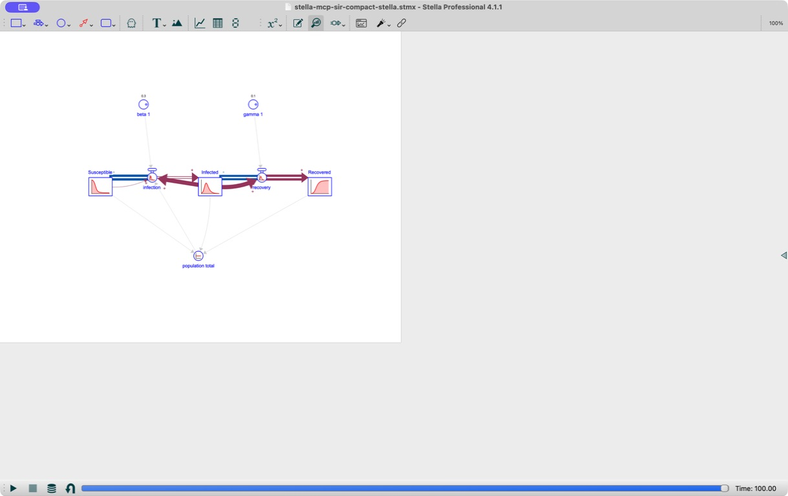

# Stella MCP SIR Layout Follow-up

## Change

The built-in SIR template now uses one `768` by `596` page and a conventional
left-to-right stock-flow chain: Susceptible, infection, Infected, recovery, and
Recovered. Beta and gamma sit above their respective flows; population total
sits below the stock chain. Connector angles were recalculated from the new
element coordinates.

The historical Stella-saved fixture with the layout defect remains in the
compatibility corpus. A separate corrected fixture records the behavior after
this change.

## Verification

- Stella Professional 4.1.1 opened the corrected built-in template without a
  repair prompt.
- The diagram rendered on one visible page at `100%` with readable labels and
  without the prior off-canvas connector.
- Stella completed the model run at time `100.00` and saved the normalized
  model as `stella_4_1_1_sir_compact.stmx`.
- The compatibility-corpus tests strict-import and round-trip the Stella-saved
  file.
- The template regression test requires a one-page view, in-page element
  centers, bounded connector lengths, and the left-to-right SIR ordering.

