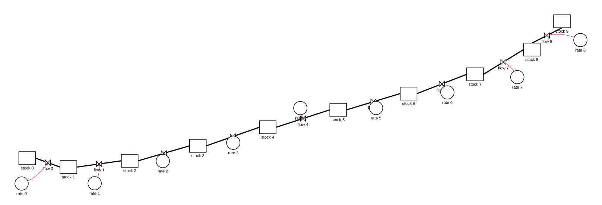
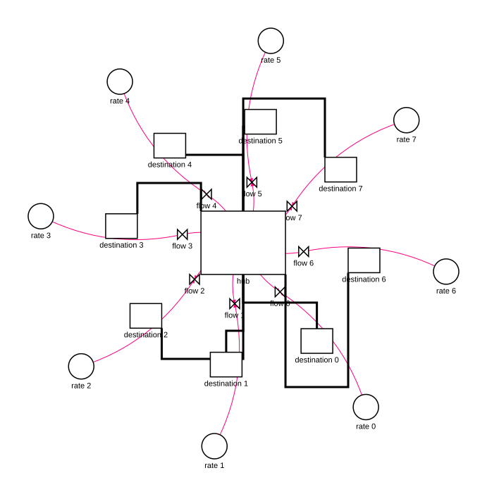
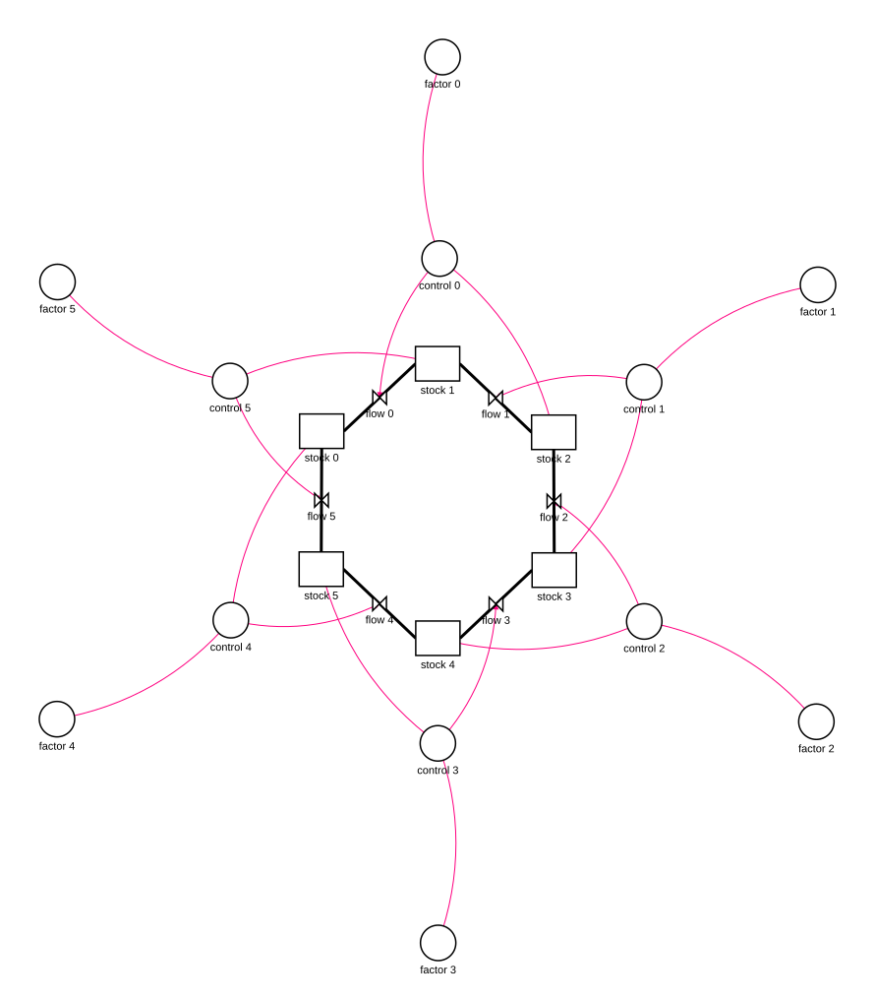
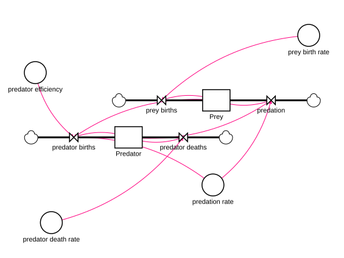
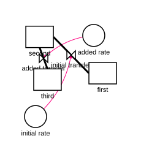

# Stella MCP 0.12 Layout Baseline

Date: 2026-07-15

This baseline records the deterministic layout behavior before the 0.12 layout
quality implementation. The machine-readable record is
[`layout-baseline-0.12/layout-report.json`](layout-baseline-0.12/layout-report.json).
It contains every generated coordinate, route, metric, and metric count.

## Reproduction

From a source checkout with `uv` installed:

```bash
uv run python -m evaluation.layout_runner \
  --output-dir /private/tmp/stella-layout-baseline-0.12
```

The runner builds nine synthetic fixtures and five built-in-template fixtures,
exports SVG and STMX artifacts, and analyzes their geometry. It also records an
incremental build before and after adding a stock, flow, auxiliary, and
connectors.

## Recorded Failures

| Case | Elements | Glyph overlaps | Label-glyph overlaps | Flow-glyph crossings | Connector-glyph crossings | Connector-flow crossings | Connector crossings | Backward acyclic flows |
| --- | ---: | ---: | ---: | ---: | ---: | ---: | ---: | ---: |
| chain | 28 | 4 | 7 | 3 | 0 | 2 | 0 | 0 |
| dense planar | 12 | 2 | 2 | 0 | 0 | 0 | 0 | 0 |
| disconnected | 7 | 0 | 0 | 0 | 0 | 1 | 0 | 0 |
| fanout | 25 | 2 | 1 | 3 | 8 | 8 | 0 | 4 |
| feedback | 24 | 0 | 0 | 0 | 0 | 6 | 6 | 0 |
| long labels | 4 | 0 | 2 | 0 | 0 | 0 | 0 | 0 |
| mixed pins | 5 | 0 | 0 | 0 | 0 | 0 | 0 | 1 |
| nonplanar | 6 | 0 | 0 | 0 | 0 | 0 | 3 | 0 |
| special flows | 5 | 1 | 2 | 0 | 0 | 0 | 0 | 0 |
| carbon cycle template | 6 | 1 | 4 | 2 | 4 | 4 | 0 | 0 |
| exponential growth template | 3 | 0 | 0 | 1 | 0 | 1 | 0 | 0 |
| Lotka-Volterra template | 10 | 0 | 0 | 0 | 2 | 4 | 1 | 0 |
| nutrient box template | 10 | 1 | 5 | 1 | 4 | 3 | 0 | 0 |
| SIR template | 8 | 0 | 0 | 0 | 0 | 1 | 0 | 1 |

The chain fixture extends 35.6 layout units beyond the configured page area.
Its longest flow is 151.57 units. The fanout fixture's longest flow is 411.50
units, while the mixed-pin fixture's longest flow is 671.48 units. The
Lotka-Volterra template's longest connector is 264.24 units. These values are
reported directly by the machine-readable baseline; the table does not apply a
pass threshold.

The incremental fixture grows from four to seven elements, but all four
pre-existing elements move by exactly 0.0 units. This demonstrates that the old
implementation mistakes auto-generated positions for user-pinned positions on
the second layout pass.

## Derived Route Limits

The retained route arrays contain 46 non-empty routes. Excluding the self-loop,
whose endpoints have zero Manhattan separation, the largest route-length ratio
is `4.497184616582285` for `fanout` route `flow:flow_6`. Rounding that value up
to the next quarter gives the release multiplier `4.5`.

The largest recorded `len(points) - 2` bend count is `2`. The release bend cap
is `4`: the baseline maximum plus one two-bend obstacle-detour pair, which
allows a single rectangular avoidance or self-loop but rejects a second
avoidable detour. `tests/test_evaluation_layout.py` recomputes both constants
directly from the retained JSON before applying them as release gates.

## Representative Output

### Chain



### Fanout



### Feedback



### Lotka-Volterra Template



### Incremental Build After Extension


