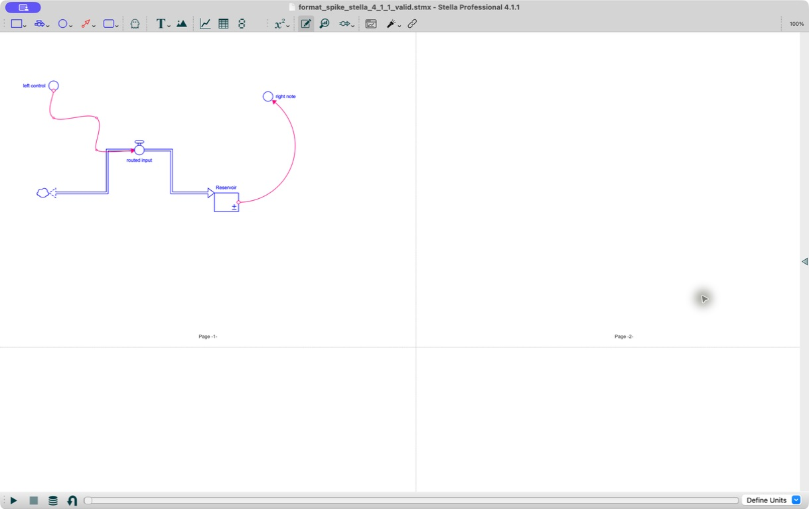

# Stella 4.1.1 Layout Format Spike

Date: 2026-07-15

The Phase 1 format spike tested the XML representation needed by the 0.12
router before implementation proceeded. The source and Stella-saved artifacts
are retained under `tests/fixtures/layout/`; their SHA-256 hashes and acceptance
record are in that directory's `manifest.json`.

## Result

Stella Professional 4.1.1 opened the hand-authored source without repair or
equation errors, ran it through time 10, and saved it successfully.

- The six-point orthogonal stock-flow route was preserved except that Stella
  clamped its final point from `(377.5, 300)` to the stock boundary at
  `(400, 300)`.
- Stella treats information-connector points as Bezier anchors rather than
  literal polyline corners. It retained the three interior anchor coordinates,
  clamped the first and last anchors to glyph boundaries, and displayed native
  rounded curves through the anchors.
- The valve remained at `(260, 220)`, on the interior horizontal segment of the
  flow route.
- Element-level `label_side` values `top`, `bottom`, `left`, and `right` were
  preserved.
- The page grid remained 3 columns by 2 rows. Stella normalized the source page
  dimensions from 640 by 480 to 776 by 588 on save.

Generated connectors therefore serialize one midpoint anchor for each logical
route segment. This keeps Stella's Bezier curve close to the route analyzed by
the package, while SVG continues to render the logical route as a polyline.
Imported, explicitly locked connector anchors are preserved unchanged. Flow
routes are emitted as orthogonal point lists because Stella normalizes diagonal
stock-flow segments on save.

The spike also established Stella's stock-coordinate convention. When explicit
`width` or `height` attributes are present, the corresponding `x` or `y` value
is the upper-left coordinate; when a dimension is omitted, Stella saves the
center coordinate. The parser and exporter convert both forms to the package's
center-based internal geometry.

## Label Calibration

At Stella's displayed 100% zoom, all four labels are readable and separated
from their glyphs. The dependency-free analyzer retains the specification's
conservative width estimate of `0.6` font pixels per display-name code point.
The screenshot shows that this estimate does not understate the observed label
widths; it intentionally leaves additional clearance for platform font
differences. Automated gates therefore use estimated label boxes, while desktop
review remains the check on actual Stella rendering.

