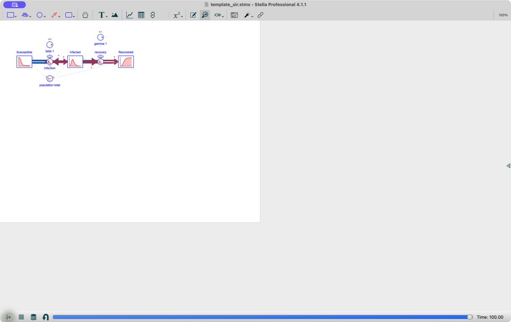
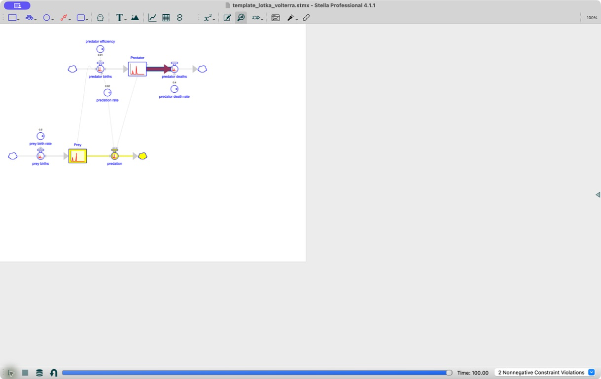
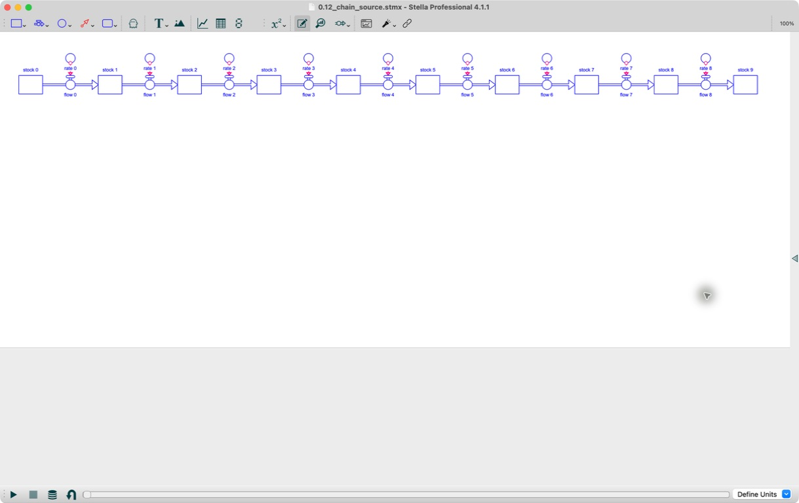
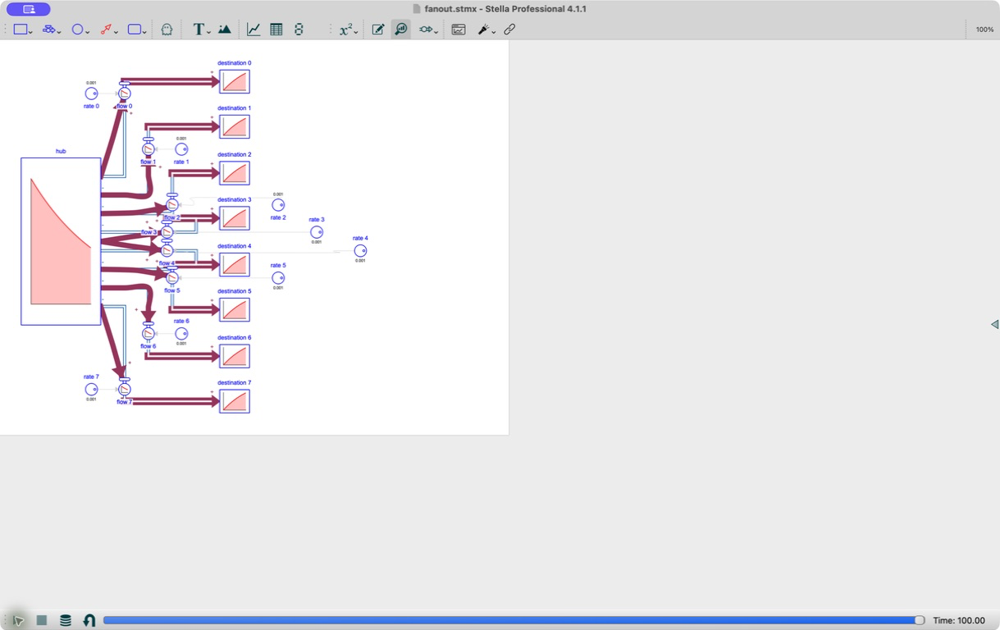
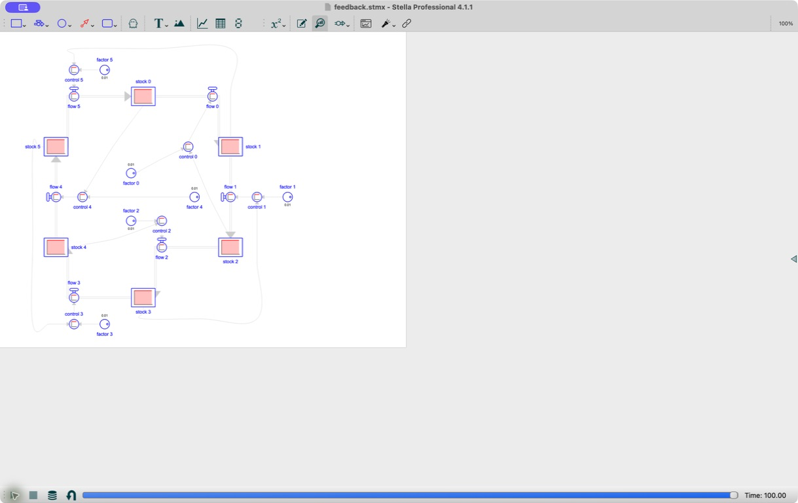

# Stella MCP 0.12 Layout Quality Evaluation

Date: 2026-07-15

## Scope

This evaluation applies the automated acceptance gates from the approved
0.12 layout-quality specification to every built-in template and the versioned
benchmark builders in `evaluation/layout_fixtures.py`. The runner writes the
normalized report and SVG previews from the same laid-out model instances.

Reproduce the artifacts with:

```bash
uv run python -m evaluation.layout_runner \
  --output-dir docs/evaluation/layout-0.12
```

The machine-readable source is
[`layout-0.12/layout-report.json`](layout-0.12/layout-report.json).

## Automated Result

Every planar fixture has zero missing positions; moved authored or locked
geometry; glyph or label overlaps; routes through unrelated glyphs or labels;
connector-flow, connector-connector, or flow-flow crossings; shared flow
segments; malformed route points; backward acyclic flows; page overflow; and
layout warnings. The analyzer also reports zero avoidable route detours: every
unlocked connector uses a direct segment when the complete diagram leaves that
segment unobstructed and unshared.

| Case | Page grid | Layout warnings | Connector crossings |
| --- | ---: | ---: | ---: |
| Chain | 2 x 1 | 0 | 0 |
| Dense planar | 1 x 1 | 0 | 0 |
| Disconnected | 1 x 1 | 0 | 0 |
| Fan-out | 1 x 1 | 0 | 0 |
| Feedback | 1 x 1 | 0 | 0 |
| Long labels | 1 x 1 | 0 | 0 |
| Special flows | 1 x 1 | 0 | 0 |
| Carbon-cycle template | 1 x 1 | 0 | 0 |
| Exponential-growth template | 1 x 1 | 0 | 0 |
| Lotka-Volterra template | 1 x 1 | 0 | 0 |
| Nutrient-box template | 1 x 1 | 0 | 0 |
| SIR template | 1 x 1 | 0 | 0 |
| Known non-planar control | 1 x 1 | `layout.unavoidable_crossing` | 1 |

The mixed-pins fixture retains its authored `2 x 2` page grid and has no hard
violations. Repeated runs return equal normalized `LayoutResult` values. The
incremental record contains one authored stock coordinate; it is identical
before and after extension. Three pre-existing auto-generated elements move by
a combined `127.54` layout pixels when the new branch is added, positively
demonstrating that the second export recomputes auto geometry instead of
treating first-export coordinates as pinned.

The route-property gates are a maximum of four bends and `4.5` times endpoint
Manhattan distance. Both are derived from the retained Phase 1 baseline before
being applied to the accepted output: `4.5` is the next quarter above its
largest finite ratio (`4.497184616582285`), and four bends are the baseline
maximum of two plus one two-bend obstacle-detour pair. The constants are
exported in the report's `acceptance` object and recomputed from baseline data
by the release tests.

## Compatibility Coverage

- Strict generated-XMILE round trips compare equations, stock-flow links, page
  geometry, label sides, flow points, and connector points.
- Direct information connectors retain Stella's midpoint Bezier anchors.
  Stock-flow pipes use direct segments only between aligned ports because the
  Phase 1 spike demonstrated that Stella rewrites diagonal flow segments.
- SVG tests compare rendered connector polylines and all four label sides with
  model geometry.
- Native MCP tests verify structured metrics and warning summaries for
  `save_model`, `get_model_xml`, and `render_diagram`.
- The core layout path has no new mandatory runtime dependency.

## Stella Professional 4.1.1

SIR, Lotka-Volterra, chain, fan-out, and feedback all passed the desktop
protocol in Stella Professional 4.1.1 on 2026-07-15. Each generated artifact:

- opened without repair or equation errors;
- ran to its configured final time of 100;
- saved from Stella and strict-imported into Stella MCP;
- retained supported model semantics, page dimensions and grid, label sides,
  element centers, and every flow route point exactly; and
- retained every interior connector anchor exactly. The largest measured
  connector-endpoint adjustment was `19` pixels, equal to the
  19-pixel gate defined by the package's 18-pixel auxiliary radius plus one
  pixel of clearance.

Stella consistently renamed the SIR auxiliaries `beta` and `gamma` to `beta_1`
and `gamma_1` because the original names conflict with Stella identifiers. The
saved equations and connectors use the same mapping, and the normalized
semantic comparison passes. No other fixture required a name mapping.

Visual review at 100% confirmed separated labels and traceable paths. The chain
is a straight 2-by-1-page sequence. Fan-out uses eight distinct orthogonal
channels and fits one page. Feedback uses one-page ring and perimeter corridors
without avoidable crossings or glyph overlap. Lotka-Volterra keeps its coupled
components compact and aligned; SIR is a compact left-to-right chain.

The source, Stella-saved artifacts, screenshots, hashes, page grids, endpoint
deltas, run results, and visual findings are versioned in
`tests/fixtures/layout/manifest.json`. The complete source-versus-Stella
comparison is enforced by `tests/test_stella_layout_acceptance.py`.










