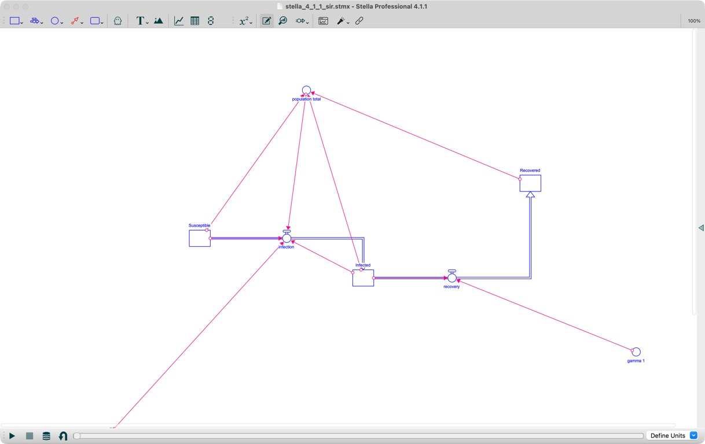

# Evaluation Guide

## 0.13 Trust Evidence

Version 0.13 combines several distinct evidence sources. The generated
[`0.13.0-capability-matrix.md`](0.13.0-capability-matrix.md) keeps permissive
parsing, strict acceptance, supported-semantic preservation, unsupported-XML
preservation, PySD simulation, Stella numeric exports, and desktop open/run/save
evidence separate. It applies only to the retained fixtures.

The completed local automated, distribution, and manual release checks are
recorded in [`0.13.0-release-gates.md`](0.13.0-release-gates.md). GitHub Actions
remains a separate gate after the release branch is pushed.

The pinned external corpus manifest is
`tests/fixtures/external_corpus/manifest.json`. Tests run from vendored files and
do not download upstream content. Verify the synchronized summary records with:

```bash
uv run --extra sim python -m evaluation.numeric_fidelity_report --check
uv run --extra sim python -m evaluation.capability_matrix --check
```

The numeric summary is
[`0.13.0-numeric-fidelity.md`](0.13.0-numeric-fidelity.md). It records raw
per-variable discrepancies and applies no pass threshold or interpolation. The
Lotka-Volterra `predation` discrepancy is retained as a PySD/Stella
non-negative-flow semantic difference rather than accepted by a tolerance.

The six package-generated cases were opened, run, exported, saved, and visually
reviewed in Stella Professional 4.1.1. Their manifest and operator notes are in
[`0.13.0-desktop-acceptance.md`](0.13.0-desktop-acceptance.md), with source,
Stella CSV, Stella-saved model, and hash records under `results/evaluation/`.

Because built-in templates changed, the automated layout evaluation was rerun
under [`layout-0.13/`](layout-0.13/). Regenerate it with:

```bash
uv run python -m evaluation.layout_runner \
  --output-dir docs/evaluation/layout-0.13
```

The pre-implementation layout benchmark for the 0.12 quality milestone is
documented in the
[`2026-07-15-layout-baseline.md`](2026-07-15-layout-baseline.md) report.
The corresponding Stella representation check is documented in the
[`2026-07-15-layout-format-spike.md`](2026-07-15-layout-format-spike.md) report.
The post-implementation automated results and desktop protocol are documented
in [`2026-07-15-layout-quality.md`](2026-07-15-layout-quality.md), with generated
JSON and SVG artifacts under [`layout-0.12/`](layout-0.12/).
The source, Stella Professional 4.1.1-saved fixtures, screenshots, hashes, and
desktop findings are recorded in `tests/fixtures/layout/manifest.json` and
enforced by `tests/test_stella_layout_acceptance.py`.

Regenerate the layout-quality artifact set with:

```bash
uv run python -m evaluation.layout_runner \
  --output-dir docs/evaluation/layout-0.12
```

## Deterministic Baseline

From a source checkout with `uv` installed:

```bash
uv run --extra sim python -m evaluation.runner \
  --require sim \
  --artifact-dir /private/tmp/stella-mcp-evaluation/artifacts \
  --output-json results/evaluation/0.11.0-baseline.json \
  --output-markdown results/evaluation/0.11.0-baseline.md
```

Use `--scenario ID` repeatedly to run a subset. Omitting the `sim` extra skips
only scenarios that declare that capability; `--require sim` converts that
condition into a startup failure.

Reports include the tool-catalog hash and generated artifact hashes. Tool result
text replaces repository and artifact-directory paths with stable tokens so the
record does not retain local machine paths.

## Desktop Workflow

Candidate `.stmx` artifacts are opened, run, and saved in Stella Professional.
Accepted files are copied to `tests/fixtures/compat_corpus/` and registered in
its `manifest.json` with application provenance and visual notes. Check manifest
integrity with:

```bash
uv run python scripts/sync_compat_corpus_manifest.py --check
```

The screenshot below records the connector-layout issue observed in the SIR
fixture under Stella Professional 4.1.1.



The corrected built-in template and its Stella-saved fixture are documented in
the [SIR layout follow-up](2026-07-13-sir-layout-followup.md).

## Numeric Comparison

The first desktop comparison is documented in
[`2026-07-13-numeric-parity.md`](2026-07-13-numeric-parity.md). Reproduce its
PySD run and machine-readable report with:

```bash
uv run --extra sim python -m evaluation.desktop_parity \
  tests/fixtures/compat_corpus/stella_4_1_1_accumulator.stmx \
  results/evaluation/0.12.0-accumulator-stella.csv \
  --pysd-output results/evaluation/0.12.0-accumulator-pysd.csv \
  --output-json results/evaluation/0.12.0-accumulator-parity.json \
  --stella-version 4.1.1 \
  --stella-time Years \
  --column Accumulator=Accumulator \
  --column input=input \
  --column rate=rate
```

The orchestration command records artifact hashes and engine versions. Its
underlying comparator performs no interpolation and sets no pass threshold. It
rejects missing, non-numeric, or non-finite values and reports maximum absolute
and relative discrepancies for each explicit column mapping.

## Interpretation

This harness measures deterministic MCP and model workflows. A free-form LLM
agent evaluation would be a separate experiment because it introduces model,
prompt, endpoint, sampling, and scoring choices. Those variables are not part of
the 0.11.0 baseline.

## Free-Form Agent Protocol

The separate protocol is specified in
[`../plans/2026-07-13-free-form-agent-evaluation-spec.md`](../plans/2026-07-13-free-form-agent-evaluation-spec.md)
and versioned in `evaluation/agent_scenarios.json`. From a source checkout, run
it with an explicitly approved provider, model, and supported sampling mode:

```bash
uv run --group agent-eval --extra sim \
  python -m evaluation.run_agent_evaluation \
  --provider PROVIDER \
  --model MODEL_ID \
  --sampling-mode SAMPLING_MODE \
  --reasoning-effort REASONING_EFFORT \
  --artifact-dir results/evaluation/0.13.0-agent-artifacts \
  --output-json results/evaluation/0.13.0-agent-evaluation.json \
  --output-markdown results/evaluation/0.13.0-agent-evaluation.md
```

`PROVIDER` is `openai` or `washu`. `SAMPLING_MODE` declares which of the
protocol's requested `temperature` and `seed` fields the chosen endpoint/model
supports: `both`, `temperature`, `seed`, or `none`. The command refuses to
replace existing expected artifacts or result files. `REASONING_EFFORT` is an
optional endpoint/model run parameter; GPT-5.6 Chat Completions with function
tools requires `none`.

Protocol v2 executes each scenario in three fresh MCP sessions and scores
workflow, semantic state, artifacts, completion, and tool health separately.
The aggregate is a raw repeated-run count, not an estimated general success
rate. CI validates the protocol, runner, scoring, redaction, and deterministic
MCP workflows without calling an external model API; paid endpoint runs remain
retained manual release evidence.

The retained 0.13 personal OpenAI run is
[`0.13.0-agent-evaluation.md`](../../results/evaluation/0.13.0-agent-evaluation.md).
All 9 runs passed every required dimension across 51 MCP calls with no failed,
recovered, or errored tool outcomes. This is descriptive evidence for the
recorded model, endpoint, prompts, and tool catalog only.
