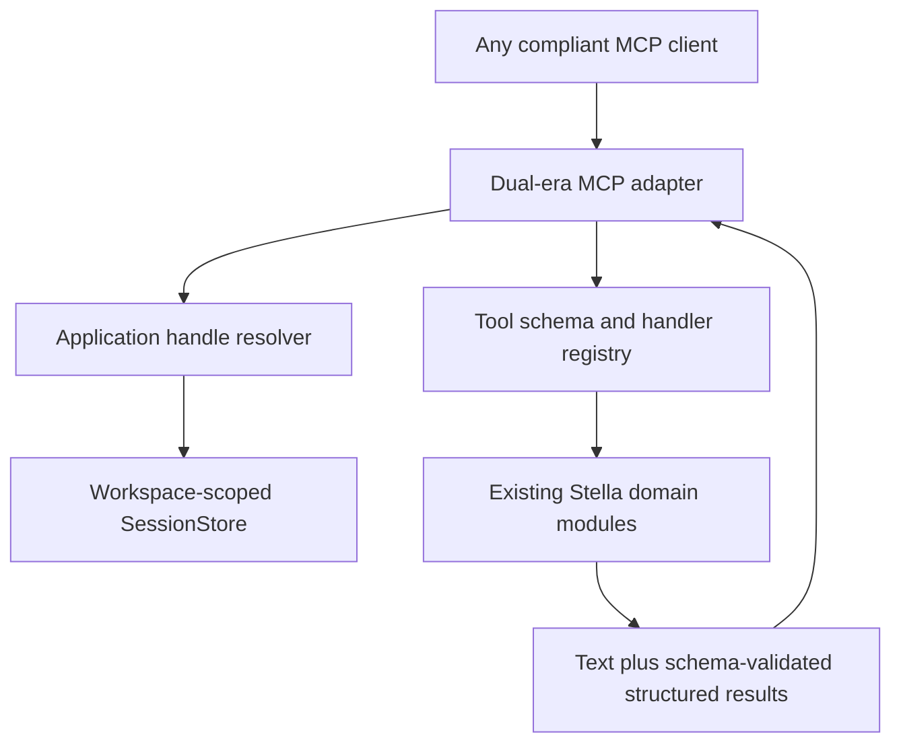
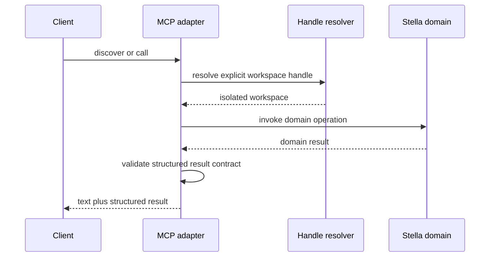
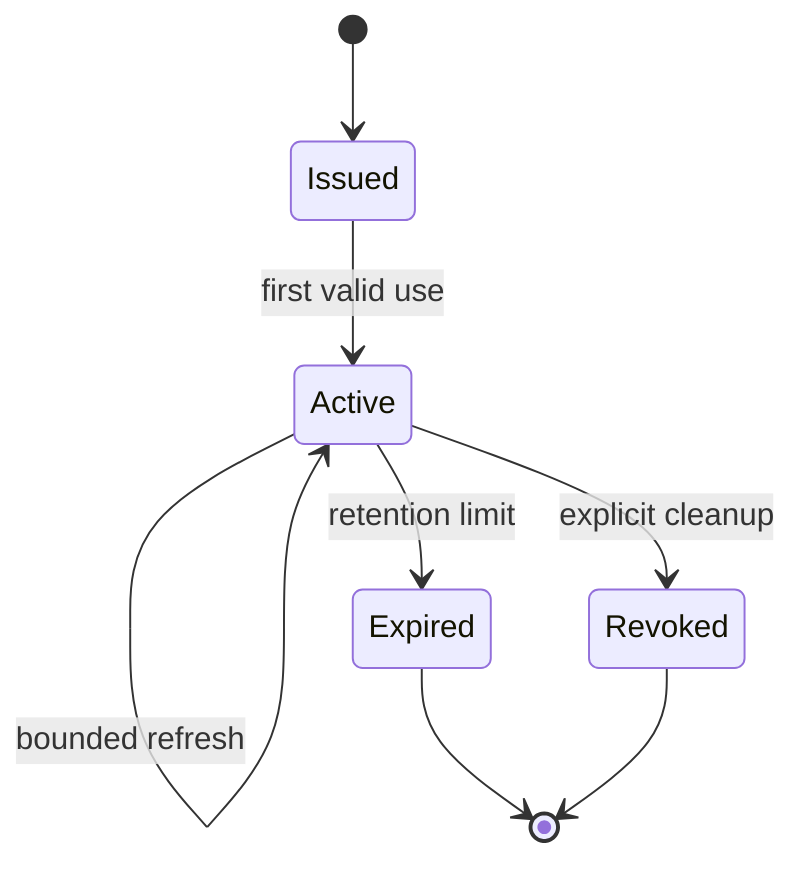

# refactor: Modernize Stella MCP for MCP 2026-07-28

## Goal Capsule

- **Objective:** Move Stella MCP onto the vendor-neutral MCP 2026-07-28 protocol and Python SDK v2 while preserving the existing 42-tool behavior for supported older clients.
- **Authority:** The MCP 2026-07-28 specification and Python SDK v2 behavior govern the wire boundary; Stella's existing domain behavior, scientific evidence, and release gates remain authoritative behind that boundary.
- **Execution profile:** Characterize the current boundary first, migrate the protocol adapter and state ownership, add truthful structured-output contracts, then publish an independently usable `0.14.0` release.
- **Stop conditions:** Do not merge if the migration changes Stella/XMILE semantics, weakens error classification, loses model isolation, or cannot pass both legacy-client and 2026-07-28-client acceptance paths.
- **Tail ownership:** This plan ends with a tagged and verified `0.14.0` distribution. Code Mode is explicitly excluded and cannot begin against an unreleased migration branch.

---

## Product Contract

### Summary

MCP 2026-07-28 removes the protocol session and handshake assumptions on which Stella's current adapter depends. This change replaces transport-session identity with explicit application-owned handles, upgrades the SDK-facing adapter, and makes tool results machine-checkable without altering the system-dynamics domain layer.

The result is a vendor-neutral Stella MCP server usable by any compliant client. Claude is one client ecosystem, not the owner or boundary of this work; host support for optional MCP extensions may still vary.

### Problem Frame

The current server uses the MCP Python SDK v1 low-level decorators, ambient `server.request_context`, initialization, camelCase Python model attributes, and an `id(session)` key for `SessionStore`. Those are protocol-adapter assumptions rather than Stella domain concepts. Carrying them forward would make the server incompatible with the stateless 2026-07-28 core and would leave state ownership implicit.

The current tools already return useful `structuredContent`, but the catalog does not declare `outputSchema`. Clients therefore cannot reliably validate or generate types for those return values, and changes to a returned field can escape the tool-catalog snapshot.

### Requirements

**Protocol and compatibility**

- R1. The server implements the MCP 2026-07-28 request/response core through the stable Python SDK v2 interfaces.
- R2. One installed server artifact supports both 2026-07-28 clients and the project's explicitly tested legacy-client floor through the SDK's supported dual-era path.
- R3. Existing tool names, input behavior, annotations, resources, prompts, textual results, and Stella-domain semantics remain backward compatible unless a documented protocol requirement makes an exact behavior impossible.
- R4. Python-facing SDK fields and result construction use v2 conventions while wire-format camelCase remains SDK-owned.

**Application state**

- R5. Stateful model operations use an explicit opaque application handle rather than transport identity or ambient request context.
- R6. A handle identifies one isolated model workspace containing its model registry and current-model pointer; unknown, malformed, expired, or unauthorized handles fail with classified tool errors.
- R7. New clients create and revoke workspaces through appended lifecycle tools. Tool discovery marks `workspace_id` required on stateful tools for 2026-07-28 clients and optional for supported legacy stdio clients; legacy calls that omit it resolve to one process-local compatibility workspace.
- R8. Workspace-aware model resources use `stella://workspaces/{workspace_id}/models/{model_id}`. Immutable template resources remain global; legacy model resource behavior is limited to the documented compatibility workspace.
- R9. Model resources either encode enough workspace identity to resolve safely or are explicitly limited to immutable templates and the documented compatibility workspace; resource listing and reading may not recover state from ambient transport context.
- R10. All operations within one workspace are serialized by a per-workspace lock whose lifecycle matches the workspace; independent workspaces may execute concurrently.
- R11. `workspace_id` is an opaque routing identifier, not an authorization secret. Stdio relies on its single-process caller trust boundary; any shipped multi-user HTTP transport binds workspace ownership to authenticated principals and rejects cross-principal replay. Any future bearer credential remains separate from resource URIs, tool results, logs, and errors.

**Structured outputs**

- R12. Every tool that returns `structuredContent` has an accurate JSON Schema 2020-12 `outputSchema`, or a documented temporary exception when a truthful contract cannot yet be stated.
- R13. The 17 tools that currently return only text receive additive structured success payloads before an `outputSchema` is declared: `create_model`, `add_stock`, `add_flow`, `add_aux`, `add_connector`, `set_connector_routing`, `rename_variable`, `delete_variable`, `read_model`, `create_module`, `add_to_module`, `remove_from_module`, `rename_module`, `delete_module`, `set_module_view`, `set_module_style`, and `auto_place_module_boxes`.
- R14. Declared output schemas describe the actual structured value, including required fields, nullability, nested objects, arrays, and closed shapes where evolution is intentionally controlled.
- R15. Human-readable `content` remains available for legacy clients; `structuredContent` is the canonical machine-readable result for clients that support it.
- R16. Tests fail when a handler's successful structured result does not validate against its declared contract. Error-result validation follows the behavior confirmed from the stable SDK/spec and is covered explicitly rather than assumed.

**Protocol metadata and extensions**

- R17. Cache hints are added only to deterministic, non-user-specific discovery data after an inventory identifies safe scope and invalidation behavior.
- R18. Optional extensions, including Tasks, are adopted only when both the stable Python SDK and Stella use case provide a concrete lifecycle benefit; they are not required for the core migration.
- R19. Authentication and HTTP-header changes are documented and tested if HTTP transport is shipped; stdio-only behavior must not claim HTTP validation.

**Release**

- R20. `0.14.0` is released after migration acceptance and before any Code Mode implementation.
- R21. Release evidence distinguishes local verification, CI, built-artifact validation, publication, and client acceptance.
- R22. The release notes state the new protocol support, tested compatibility envelope, structured-output contract coverage, and any extension or transport limitations without claiming universal client feature parity.

### Acceptance Examples

- AE1. A 2026-07-28 client discovers the catalog, creates a workspace handle, builds a model, validates it, renders it, saves it, and receives schema-valid structured results.
- AE2. A supported legacy client completes the existing stdio growth-model workflow with the same tool names and human-readable outcomes.
- AE3. Two concurrent handles can use the same `model_id` without observing or mutating each other's models.
- AE4. Outside the documented legacy stdio default-handle contract, a missing or invalid handle produces a stable classified error rather than falling back to a shared global workspace.
- AE5. The published wheel installs into a clean environment and completes both protocol-era smoke tests before Code Mode evaluation begins.

### Scope Boundaries

**Included**

- MCP Python SDK v2 migration, dual-era transport acceptance, explicit application state, structured-output contracts, safe cache hints, release documentation, and `0.14.0` publication gates.

**Deferred to follow-up work**

- Public `StellaAPI`, programmatic tool orchestration experiments, isolated code execution, and any Code Mode tool.
- Tasks or other optional extensions whose stable SDK support or Stella benefit is not yet sufficient.
- New Stella/XMILE modeling capabilities unrelated to the protocol boundary.

---

## Planning Contract

### Key Technical Decisions

- KTD1. **MCP v2 is a server-wide, vendor-neutral foundation.** It is not a Claude-specific branch; host-specific extensions remain optional adapters.
- KTD2. **Publish `0.14.0` before Code Mode.** (session-settled: user-directed — chosen over combining migration and Code Mode: the release creates an independently testable compatibility and rollback boundary.)
- KTD3. **Use explicit opaque application handles.** Transport sessions and ambient request context are not state authority in the 2026-07-28 core. Appended lifecycle tools create and revoke workspaces; stateful tools accept the non-secret routing identifier `workspace_id`, required for 2026-07-28 calls; model resource URIs carry that identifier; supported legacy stdio calls may use only the documented process-local compatibility workspace; and authorization remains a separate transport concern.
- KTD4. **Keep the Stella domain layer protocol-agnostic.** `StellaModel`, validators, simulation, layout, XMILE, templates, and handler-domain modules remain behind a narrow adapter boundary.
- KTD5. **Treat `outputSchema` as a public return contract.** Schemas are derived from audited result families and checked against runtime results; they are not decorative catalog metadata.
- KTD6. **Preserve text and structured results together.** This supports older clients while enabling typed consumers and avoids coupling user-readable prose to machine parsing.
- KTD7. **Do not make optional extensions migration blockers.** Core stateless compatibility ships first; extension adoption needs its own support and value evidence.

### What an `outputSchema` Contract Means

`inputSchema` describes the arguments a client may send to a tool. `outputSchema` describes the JSON value the server promises to return in `structuredContent`. For `validate_model`, the contract should state that a successful result contains a string `model_id`, a boolean `passed`, and an array of issue objects, including the exact fields and nullability of those objects. It does not describe the parallel human-readable text in `content`.

This contract enables client-side validation, generated types, better model/tool discovery, and regression detection. It also creates maintenance cost: a schema that is broader than reality provides false assurance, while a schema narrower than reality breaks valid calls. The migration therefore inventories actual outputs before declaring contracts and keeps reusable schema fragments next to the owning result builders.

### High-Level Technical Design

The design below is directional. Exact SDK APIs are resolved against the stable v2 documentation during implementation.

### System-Wide Impact

- **Clients:** New clients gain stateless-core support and typed results; older supported clients retain the current tool workflow.
- **Developers:** Protocol types, handler context, test fixtures, and naming conventions change together, so partial migration is unsafe.
- **Operations:** Application handles introduce retention and cleanup responsibilities even when stdio remains the primary transport.
- **Scientific behavior:** No numerical method, model semantics, compatibility classification, layout method, or scientific acceptance threshold changes under this plan.
- **Future Code Mode:** A clean protocol-neutral API boundary and explicit workspace identity become prerequisites, not code-execution features themselves.

### Risks and Mitigations

- **SDK churn:** Pin an exact stable v2 range after a compatibility spike and retain a focused floor test.
- **False dual-era confidence:** Run real clients for both protocol eras against the same built artifact; unit tests alone are insufficient.
- **State leakage:** Make missing-handle behavior explicit, test concurrent isolation, and bound retention instead of keying by object identity.
- **Schema drift:** Validate representative success results for every tool and fail catalog snapshot tests on contract changes.
- **Error-contract ambiguity:** Confirm stable SDK behavior for errored tool results before finalizing whether error structured content is absent, separately shaped, or represented by a documented union.
- **Overclaiming extension support:** Record extension support individually by SDK version, transport, and tested client.

### Sources and Research

- [MCP 2026-07-28 release](https://blog.modelcontextprotocol.io/posts/2026-07-28/) — stateless core, application handles, cache hints, headers, auth changes, and extensions.
- [MCP 2026-07-28 release candidate](https://blog.modelcontextprotocol.io/posts/2026-07-28-release-candidate/) — full JSON Schema 2020-12 for tool inputs and outputs.
- [Python SDK v2 changes](https://github.com/modelcontextprotocol/python-sdk/blob/main/docs/whats-new.md) — dual-era support, handler context, naming, result validation, and exception behavior.
- [Python SDK v2 low-level server guide](https://py.sdk.modelcontextprotocol.io/v2/advanced/low-level-server/) — stable low-level adapter patterns.
- [Claude MCP 2026-07-28 rollout](https://claude.com/blog/bringing-mcp-2026-07-28-to-claude) — one client ecosystem's adoption, not a protocol ownership boundary.

---

## Implementation Units

### U1. Characterize and pin the protocol boundary

- **Goal:** Establish the exact SDK v2 dependency range, legacy-client floor, and behavior matrix before changing production code.
- **Requirements:** R1-R4, R16, R18-R19
- **Files:** `pyproject.toml`, `uv.lock`, `tests/test_mcp_stdio.py`, new protocol compatibility tests, `docs/architecture.md`
- **Approach:** Build a minimal spike around the stable v2 APIs; record supported server/client combinations, confirm handler concurrency behavior, and verify how successful and errored structured results are validated. Convert the spike into characterization tests before adapter replacement.
- **Test scenarios:** A new client and a legacy client each discover tools/resources/prompts and call a representative success and failure; SDK field naming serializes correctly; unsupported combinations fail with a documented message rather than hanging.
- **Verification:** The compatibility matrix is sourced to exact installed versions, and tests fail against an intentionally unsupported API assumption.

### U2. Replace transport-session identity with application handles

- **Goal:** Make workspace state explicit, isolated, and lifecycle-bounded.
- **Requirements:** R5-R11
- **Files:** `stella_mcp/session_store.py`, `stella_mcp/server.py`, `stella_mcp/mcp_resources.py`, `tests/test_session_store.py`, `tests/test_server_state_and_gf.py`, `tests/test_mcp_stdio.py`
- **Approach:** Append explicit workspace lifecycle tools; advertise `workspace_id` as required on stateful tools to 2026-07-28 clients and optional to legacy clients; and map omitted legacy stdio handles to one documented process-local compatibility workspace. Encode workspace identity in model resource URIs, keep templates global, and serialize each workspace through a lifecycle-bound lock. Add bounded expiry/revocation tombstones without durable persistence in this release.
- **Test scenarios:** Separate workspaces with identical model IDs remain isolated; current-model pointers do not cross workspaces; outside the documented legacy stdio compatibility contract, missing, malformed, expired, and revoked workspace IDs return classified errors; cleanup removes only the targeted workspace; sequential legacy stdio calls retain their intended workspace; concurrent calls against one workspace follow the declared serialization policy; model resource URIs cannot cross workspace boundaries; resource listings and URI logs expose no authorization credential; any shipped HTTP path rejects cross-principal replay.
- **Verification:** No production path reads ambient `server.request_context` or keys state with Python object identity.

### U3. Migrate the MCP adapter to SDK v2

- **Goal:** Serve the existing Stella surface through the stateless 2026-07-28 core and the supported dual-era adapter.
- **Requirements:** R1-R4, R8, R19
- **Files:** `stella_mcp/server.py`, `stella_mcp/mcp_resources.py`, `stella_mcp/tool_handlers.py`, `stella_mcp/tool_schemas.py`, `tests/test_mcp_surface.py`, `tests/test_mcp_stdio.py`
- **Approach:** Move handlers to explicit request context and v2 naming/result conventions while keeping protocol logic out of domain modules. Preserve catalog order and annotations unless the new protocol requires a documented change.
- **Test scenarios:** Catalog discovery returns all 42 tools with unchanged names; resources and prompts round-trip; representative build, validate, render, save, read, and unknown-tool calls work in both eras; unexpected exceptions remain sanitized while expected tool errors stay actionable.
- **Verification:** Wire snapshots and end-to-end client tests prove behavior rather than direct calls to decorated functions alone.

### U4. Add truthful output contracts and safe protocol metadata

- **Goal:** Make structured results machine-checkable without breaking human-readable compatibility.
- **Requirements:** R12-R18
- **Files:** `stella_mcp/tool_results.py`, `stella_mcp/tool_schemas.py`, `stella_mcp/tools/*.py`, `tests/test_mcp_surface.py`, new structured-output contract tests
- **Approach:** Inventory result families, add structured success payloads to the 17 text-only tools, define reusable JSON Schema 2020-12 fragments beside their owning tool domains, attach schemas, and validate returned `structuredContent`. Add cache hints only after classifying catalog/template discovery as global, workspace-specific, or non-cacheable.
- **Test scenarios:** Every structured success result validates; deliberately removed required fields fail tests; nullable and union-valued results validate only when declared; text content remains present; user-specific model resources are never marked globally cacheable.
- **Verification:** The tool-catalog snapshot includes `outputSchema` and cache metadata, and every exception is named with an owner and removal condition.

### U5. Run dual-era acceptance and publish `0.14.0`

- **Goal:** Produce an independently usable MCP-v2 release before Code Mode begins.
- **Requirements:** R20-R22
- **Files:** `pyproject.toml`, `CHANGELOG.md`, `README.md`, `docs/architecture.md`, `docs/releases/0.14.0.md`, `docs/evaluation/0.14.0-release-gates.md`, packaging scripts and CI configuration as required
- **Dependencies:** U1-U4
- **Approach:** Update vendor-neutral client documentation, build distributions, validate clean installs, run the complete existing scientific/evaluation suite, retain dual-era protocol evidence, and publish only after main-branch CI and artifact checks pass.
- **Test scenarios:** A clean core wheel passes discovery and the build/validate/save workflow with both client eras; the simulation extra passes the existing deterministic evaluation; package metadata and bundled templates are correct; no Code Mode tool or executor is present in the catalog.
- **Verification:** Tag, published package version, release notes, CI result, and clean-install evidence all identify the same commit and version.

---

## Verification Contract

| Gate | Scope | Done signal |
|---|---|---|
| Focused protocol tests | Catalog, dual-era stdio, handles, schemas, errors | Both protocol eras pass against the same server artifact |
| Complete core suite | Existing Stella, XMILE, layout, templates, and MCP behavior | No regression outside explicitly reviewed protocol adapter changes |
| Simulation suite | Simulation, scenarios, sensitivity, calibration, retained evidence | Existing scientific methods and evidence remain unchanged or differences are explicitly investigated |
| Static and lock checks | Ruff, dependency lock, SDK floor/range | Clean and reproducible dependency resolution |
| Distribution checks | Wheel, source archive, metadata, clean install | Published contents and imports match the audited tree |
| Release acceptance | Main CI, tag, package publication, client smoke tests | `0.14.0` is independently installable and usable before Code Mode work starts |

---

## Definition of Done

- U1-U5 meet their test scenarios and verification statements.
- The stable SDK v2 range and tested legacy compatibility floor are documented with exact versions.
- No production state path depends on transport object identity or ambient request context.
- Declared output schemas validate actual structured results and retain human-readable content.
- The same built artifact passes both protocol-era client workflows.
- Existing scientific and desktop evidence gates remain intact; no silent method or threshold change is introduced.
- `0.14.0` is merged, tagged, published, clean-install verified, and documented with exact commit provenance.
- The tool catalog at `0.14.0` contains no Code Mode executor.
- Experimental or abandoned migration code is removed from the final diff.
