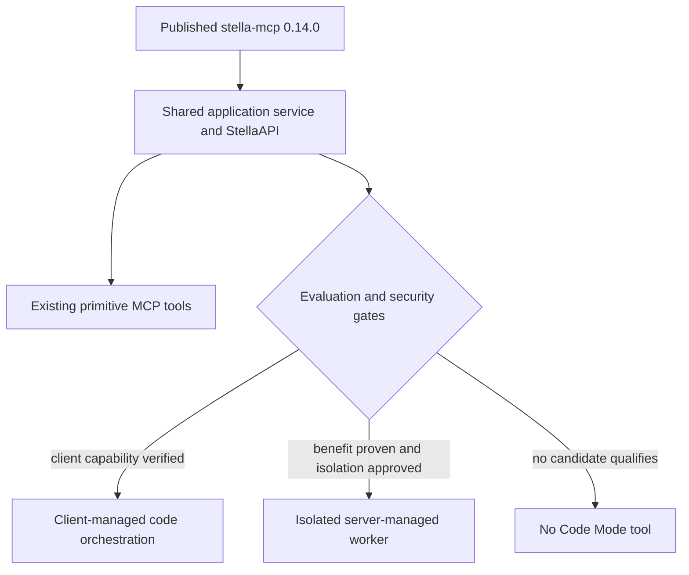
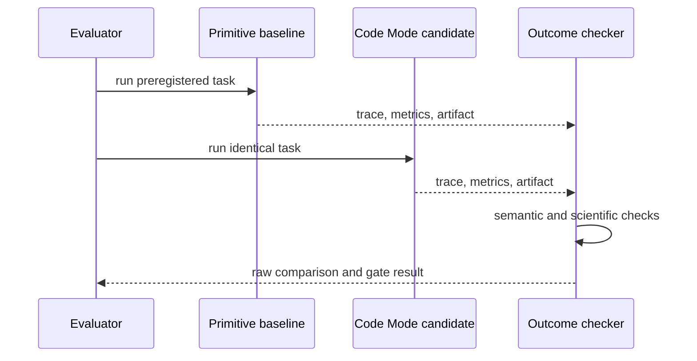
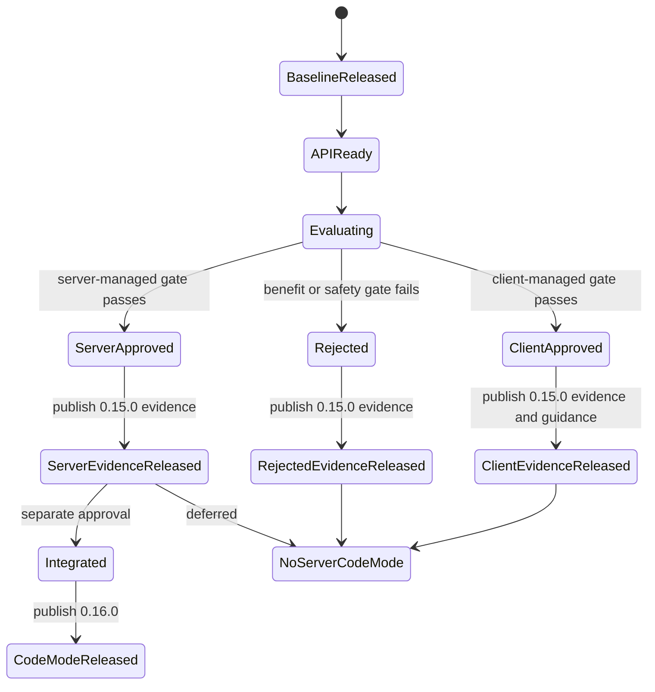

# feat: Evaluate and conditionally add Code Mode

## Goal Capsule

- **Objective:** Determine whether Code Mode measurably improves realistic Stella workflows, then ship only the smallest safe implementation supported by that evidence.
- **Authority:** The published `0.14.0` MCP-v2 artifact is the baseline. The existing 42-tool interface remains the compatibility and outcome reference; `docs/plans/2026-08-06-code-mode-spec.md` supplies candidate API ideas but not an approved execution architecture.
- **Execution profile:** First extract a reusable public `StellaAPI` and evaluate client-managed orchestration. Evaluate an isolated server-managed candidate only if client-managed orchestration is unavailable or inadequate. Implementation after the evaluation gate is conditional.
- **Stop conditions:** Do not add an in-process Python executor, claim sandboxing from restricted builtins, or make Code Mode primary without evidence across complex and simple workflows.
- **Tail ownership:** Publish `0.15.0` with the API, verified client-managed guidance, and evaluation evidence but no `code` tool. Only a server-managed candidate that clears the gate may proceed to a separately reviewed and released `0.16.0`; otherwise the existing MCP surface remains primary.

---

## Product Contract

### Summary

Code Mode is an orchestration pattern, not part of the MCP 2026-07-28 core. It can reduce model/tool round trips for compositional work, but it also adds a second programming interface, a code-generation burden, and potentially a remote-code-execution boundary. The correct Stella design depends on where code runs and whether current clients can use MCP tools from their managed code environments.

This plan separates the generally valuable `StellaAPI` from any executor. It evaluates three outcomes: client-managed orchestration over MCP tools, isolated server-managed execution, or no Code Mode. The original proposal's in-process `exec`/restricted-builtins design is not an acceptable implementation candidate because language-level restriction is not a security boundary.

### Requirements

**Prerequisite and baseline**

- R1. Code Mode work starts only after the exact published `stella-mcp==0.14.0` artifact passes its release acceptance gates.
- R2. The evaluation compares candidates against the existing primitive-tool interface using the same tasks, expected artifacts, scientific checks, and completion criteria.
- R3. Results separate complex multi-step workflows from one- or two-call tasks, where code generation may add cost without benefit.

**Public API**

- R4. `StellaAPI` is a documented, typed, JSON-serializable façade over existing domain operations; it does not reimplement Stella, XMILE, validation, simulation, layout, or calibration logic.
- R5. The API and MCP handlers share one application service layer so behavior, errors, transactions, and result shapes cannot drift independently.
- R6. API workspace identity uses the explicit application-handle model released in `0.14.0`.
- R7. The first API release covers only methods exercised by accepted evaluation scenarios; the large method list in the origin spec is a candidate inventory, not an all-at-once requirement.

**Evaluation**

- R8. Each candidate records tool calls, model turns, input/output tokens when the host exposes them, elapsed time, failures, recoveries, final artifact validity, and structured scientific/semantic outcomes.
- R9. Evaluation uses repeated fresh runs and reports raw counts and distributions without inventing a population success rate or acceptance threshold after results are observed.
- R10. A preregistered go/no-go rule requires Code Mode to improve at least one target efficiency dimension on complex tasks without degrading required semantic, artifact, completion, or tool-health outcomes.
- R11. Client capability claims are versioned and host-specific; support by Claude, ChatGPT, Cursor, or another host is not inferred from protocol compliance alone.

**Safety and control**

- R12. No server-managed candidate executes model-generated code in the Stella server process.
- R13. A server-managed executor candidate uses a real isolation boundary with CPU, wall-clock, memory, filesystem, process, network, request-size, and output-size controls, plus explicit cancellation and cleanup. Admission is bounded by per-workspace concurrency, a global worker cap, and a bounded queue with explicit rejection or backpressure.
- R14. File reads/writes from untrusted execution follow the dedicated capability policy defined in U3; generated code cannot obtain ambient credentials, arbitrary host-filesystem access, or unrestricted network access.
- R15. Code execution results distinguish user-code errors, resource-limit termination, policy denial, Stella domain errors, and internal failures without returning secrets or unrestricted tracebacks.
- R16. Mutating execution is bound to one workspace handle and defines transactional behavior: either an accepted atomic model mutation boundary or explicit partial-completion state and recovery instructions.
- R17. A server-managed worker receives only a brokered, short-lived, single-workspace execution capability. The reusable application handle remains in the trusted broker and cannot be observed, serialized, retained, or replayed by generated code.

**Compatibility and release**

- R18. All existing primitive tools remain available and are the preferred path for simple one-shot calls and clients without Code Mode support.
- R19. A `code` tool is added only if the selected server-managed candidate clears the evaluation and security gates; otherwise it remains absent.
- R20. `0.15.0` contains the public API, client-managed usage guidance where supported, and evaluation artifacts but no server Code Mode tool, creating a second explicit release boundary.
- R21. A server-managed Code Mode surface is eligible only for a separate `0.16.0` release after the `0.15.0` evidence and security gates pass and the implementation receives explicit approval. A client-managed result requires no Stella `0.16.0` release.
- R22. Evaluation traces are restricted by default, redact credentials and complete workspace capabilities before persistence, and separate sanitized reproducibility artifacts from access-controlled raw evidence with named retention ownership.

### Acceptance Examples

- AE1. The same SIR construction task run through primitive tools and each Code Mode candidate produces semantically equivalent, strict-reimportable artifacts and the same validation outcome.
- AE2. A batch family of related models uses loops or data-driven construction and demonstrates whether Code Mode reduces orchestration overhead without weakening per-model validation.
- AE3. A simple validation-only task shows whether Code Mode adds unnecessary tokens, latency, or failure opportunities relative to one primitive call.
- AE4. Infinite-loop, memory-pressure, forbidden-import, arbitrary-file, subprocess, network, and cross-workspace attempts terminate or fail at the isolation boundary without affecting the Stella server.
- AE5. If the go/no-go gate fails, the release contains no `code` tool and the negative result remains documented.

### Scope Boundaries

**Included**

- Public API extraction, shared service boundaries, reproducible comparative evaluation, host capability matrix, security design for any server-managed candidate, `0.15.0` evaluation release evidence, and a conditional `0.16.0` integration path.

**Outside this plan**

- Replacing the primitive MCP tools.
- Treating MCP v2 itself as Code Mode.
- Running model-generated Python inside the MCP server process.
- Calling `RestrictedPython`, curated builtins, timeouts, or AST filtering a complete sandbox.
- Expanding Stella/XMILE scientific capabilities merely to make evaluation tasks easier.

---

## Planning Contract

### Key Technical Decisions

- KTD1. **MCP v2 and Code Mode are separate layers.** MCP 2026-07-28 supplies the vendor-neutral transport and state foundation; Code Mode is an optional orchestration/execution strategy above it.
- KTD2. **The published `0.14.0` artifact is a hard prerequisite.** (session-settled: user-directed — chosen over evaluating on the migration branch: the baseline must be independently released and reproducible.)
- KTD3. **Extract the API before selecting an executor.** This yields a testable programmatic surface even if Code Mode is rejected and prevents execution concerns from contaminating domain logic.
- KTD4. **Prefer client-managed execution when a host can securely call Stella MCP tools from its managed code environment.** This avoids operating a sandbox, but capability must be verified per host; current Claude documentation, for example, distinguishes programmatic tool calling from MCP-connector tools.
- KTD5. **Require process or stronger isolation for server-managed execution.** Restricted Python syntax and curated builtins may be defense-in-depth inside a sandbox, never the sandbox itself.
- KTD6. **Gate on outcomes, not tool-count aesthetics.** Fewer calls are useful only if semantic correctness, artifact validity, completion, error recovery, and cost do not regress.
- KTD7. **Keep primitive tools indefinitely.** They provide interoperability, debuggability, and a superior path for simple actions.
- KTD8. **Release evaluation before server execution.** `0.15.0` ships the public API, supported client-managed guidance, and reproducible decision evidence without a server `code` tool; only a qualifying server-managed executor is a separately approved `0.16.0` change.

### High-Level Technical Design

The candidate topology is directional. The evaluation selects one branch or no Code Mode; it does not implement all branches.

### Evaluation Gate

Before running agents, freeze the scenario set, required outcomes, metric definitions, repetition count, and the decision rule. The suite should include at least one high-composition build/edit workflow, one batch or parameterized workflow, one analysis workflow, one error-recovery workflow, and simple one-shot controls.

A candidate qualifies only when:

- every required artifact, semantic, scientific, and tool-health check is non-inferior to the primitive baseline;
- at least one preregistered complex-workflow efficiency measure improves;
- simple-task regressions are documented and routed to primitive-tool guidance rather than hidden in aggregates;
- the candidate's host or sandbox capability is verified on the exact version tested; and
- server-managed execution, if selected, passes an independent security review and adversarial isolation tests.

No numeric improvement threshold is invented in this plan because no sourced baseline supports one yet. The preregistration unit must set a decision threshold from pilot variance or user direction before comparative runs begin.

### Candidate Comparison

| Candidate | Main benefit | Main limitation | Planning disposition |
|---|---|---|---|
| Primitive tools only | Broadest interoperability and clearest per-action control | More round trips for compositional work | Permanent baseline and fallback |
| Client-managed Code Mode | Host operates the code sandbox; Stella remains a normal MCP server | Host support varies and may exclude MCP-connected tools | Preferred candidate when verified; document in `0.15.0`, no Stella `0.16.0` needed |
| Isolated server-managed worker | Consistent Stella-facing interface across capable clients | Largest security and operational burden | Conditional fallback, never in-process |
| In-process restricted Python | Small implementation footprint | No credible isolation boundary | Rejected |

### System-Wide Impact

- **Agent users:** Gain a compositional API only where it improves real workflows; primitive actions remain discoverable.
- **Human users and educators:** Receive the same Stella artifacts and validation semantics regardless of orchestration path.
- **Developers:** Maintain one service layer with two possible adapters, not two domain implementations.
- **Operations/security:** A server-managed candidate creates a code-execution service with cleanup, monitoring, dependency, and incident-response obligations; this cost is part of the go/no-go decision.
- **Evaluation:** Existing trust-loop evidence supplies outcome checks, but Code Mode comparisons require new trace and cost instrumentation.

### Risks and Mitigations

- **API drift from MCP tools:** Route both through shared services and run parity contract tests.
- **Sandbox escape:** Exclude in-process execution; use an isolation boundary and independent adversarial review before exposure.
- **Misleading token savings:** Count total host/code/tool tokens where available and report unavailable fields rather than estimating them.
- **Benchmark overfitting:** Freeze tasks and gates before final runs, retain all attempts, and separate pilots from scored evidence.
- **Host-specific lock-in:** Record exact client/version capabilities and keep the primitive surface canonical.
- **Partial mutations after termination:** Prefer atomic domain operations; otherwise expose partial-completion state and workspace recovery explicitly.
- **Unbounded API scope:** Implement methods only when an accepted scenario or stable public use case requires them.

### Sources and Research

- [MCP 2026-07-28 release](https://blog.modelcontextprotocol.io/posts/2026-07-28/) — protocol foundation and extension model.
- [Claude programmatic tool calling](https://platform.claude.com/docs/en/agents-and-tools/tool-use/programmatic-tool-calling) — managed code execution benefits and current MCP-connector limitation.
- [Cloudflare Code Mode](https://developers.cloudflare.com/agents/model-context-protocol/codemode/) — isolated Worker-based prior art rather than in-process Python execution.
- [RestrictedPython documentation](https://restrictedpython.readthedocs.io/en/latest/index.html) — explicitly not a sandbox.
- [MCP Apps overview](https://modelcontextprotocol.io/extensions/apps/overview) — example of an optional host-dependent extension, reinforcing the separation of protocol core and host capabilities.

---

## Implementation Units

### U1. Freeze the post-`0.14.0` baseline and evaluation protocol

- **Goal:** Make the comparison reproducible and resistant to post-result threshold changes.
- **Requirements:** R1-R3, R8-R11
- **Files:** `evaluation/`, `tests/fixtures/evaluation/`, `docs/evaluation/README.md`, new Code Mode protocol and baseline artifacts
- **Approach:** Install the published `0.14.0` wheel in the evaluation environment, define scenarios and checks from existing agent-evaluation patterns, add simple-task controls, and preregister metrics and the decision rule before candidate runs.
- **Test scenarios:** The evaluator rejects a source checkout masquerading as the published baseline; identical retained traces reproduce the same outcome classifications; missing token or timing fields remain explicitly unavailable; pilots are excluded from scored aggregates.
- **Verification:** Protocol metadata identifies package hash/version, client/model/version, scenario revision, repetition count, seeds where applicable, and artifact checks.

### U2. Extract the shared application service and bounded `StellaAPI`

- **Goal:** Provide one protocol-neutral programmatic surface without duplicating domain logic.
- **Requirements:** R4-R7
- **Files:** new `stella_mcp/api.py` and application-service modules as justified, `stella_mcp/tools/*.py`, `stella_mcp/tool_handlers.py`, focused API and parity tests, public API documentation
- **Approach:** Move orchestration-neutral operations behind shared services and expose only scenario-required API methods. Bind every API instance to a `0.14.0` application handle and return the same structured result families used by MCP handlers.
- **Test scenarios:** API and MCP paths create equivalent models, classify the same invalid input, preserve atomic batch behavior, use isolated workspaces, and serialize the same validation/simulation/layout summaries.
- **Verification:** Coverage demonstrates delegation to existing domain modules; no copied validator, simulator, layout, XMILE, or calibration logic appears in the API layer.

### U3. Define the untrusted file-capability boundary

- **Goal:** Prevent generated code from reaching the server's ambient filesystem through otherwise legitimate Stella operations.
- **Requirements:** R12-R17
- **Files:** file-access policy component, `stella_mcp/api.py`, focused path-policy and capability tests, security documentation
- **Dependencies:** U2
- **Approach:** Inventory every path-taking operation, including model import/export, diagram output, template writes, calibration inputs, and CSV outputs. The untrusted execution profile exposes opaque input/artifact references or sandbox-mounted allowlisted roots rather than arbitrary host paths, canonicalizes paths, rejects traversal and symlink escape, and keeps trusted direct-Python use explicit and separate.
- **Test scenarios:** Absolute host paths, parent traversal, symlink escape, template-directory escape, calibration CSV escape, and output-path substitution fail; allowed input and artifact references resolve inside the authorized workspace; primitive trusted workflows retain their documented behavior.
- **Verification:** No method reachable by generated code can turn an untrusted string into unrestricted host filesystem access.

### U4. Evaluate client-managed orchestration

- **Goal:** Determine whether supported hosts can safely orchestrate Stella MCP operations from managed code and whether the pattern improves complex tasks.
- **Requirements:** R2-R3, R8-R11, R18
- **Files:** evaluation adapters, host capability matrix, retained traces and reports under `docs/evaluation/` and `results/evaluation/`
- **Dependencies:** U1-U3
- **Approach:** Verify exact host capabilities before runs. Where MCP tools cannot be called from managed code, record the candidate as unsupported rather than simulating support through a different interface.
- **Test scenarios:** Complex build, batch, analysis, recovery, and simple controls run on each supported host; an unsupported host is classified cleanly; candidate results undergo the same strict reimport and scientific checks as the baseline.
- **Verification:** Report raw per-run outcomes and metrics by host/version, with no cross-host generalization.

### U5. Design and spike an isolated server-managed candidate only if needed

- **Goal:** Establish whether a deployable isolation architecture can meet Stella's needs when client-managed orchestration is unavailable or inadequate.
- **Requirements:** R12-R17
- **Files:** a separate sandbox/worker boundary and protocol adapter if approved, threat model, isolation tests; no executor added to `stella_mcp/server.py` during the spike
- **Dependencies:** U1-U3 and evidence from U4
- **Approach:** Define trust boundaries, data exchange, workspace mutation semantics, resource limits, cancellation, cleanup, observability, and deployment ownership before choosing technology. Keep the worker disposable and pass only capability-scoped inputs and outputs.
- **Test scenarios:** Infinite loop, memory pressure, fork/subprocess, forbidden import, filesystem escape, network access, credential discovery, oversized input or output, cancellation, worker crash, handle disclosure or replay, cross-workspace substitution, and concurrent submission floods cannot compromise or stall the MCP server; cancellation reclaims capacity; permitted Stella work survives worker lifecycle as specified.
- **Verification:** Independent security review accepts the threat model and adversarial evidence. Failure keeps the candidate rejected and adds no `code` tool.

### U6. Run the comparative gate and record the decision

- **Goal:** Select client-managed, isolated server-managed, or no Code Mode from preregistered evidence.
- **Requirements:** R8-R11, R19-R22
- **Dependencies:** U1-U4 and U5 only when triggered
- **Files:** evaluation reports, capability matrix, decision record, `CHANGELOG.md`
- **Approach:** Execute fresh repeated runs, preserve access-controlled raw traces outside publishable artifacts, run a deterministic sanitizer into the retained reproducibility set, compare by task class, and apply the frozen gate. Name access and retention ownership and explain negative or mixed findings without collapsing them into a single success percentage.
- **Test scenarios:** A deliberately failing candidate is rejected; simple-task regression remains visible; missing measurements cannot be treated as improvements; injected credential and workspace-capability canaries do not appear in sanitized reports, release artifacts, or package contents; rerunning the sanitizer and report generator over retained evidence reproduces the decision.
- **Verification:** The decision record links every gate result to retained evidence and names the selected release contents.

### U7. Publish the API and evaluation release `0.15.0`

- **Goal:** Release the API/evaluation milestone without a server Code Mode tool.
- **Requirements:** R18-R20, R22
- **Dependencies:** U6
- **Files:** `README.md`, `docs/architecture.md`, `docs/releases/0.15.0.md`, `docs/evaluation/0.15.0-release-gates.md`, package metadata and CI as required
- **Approach:** Release the public API, parity coverage, capability matrix, go/no-go evidence, and client-managed usage guidance for verified hosts. Document any qualifying server-managed candidate, but defer its product integration to U8 and separate approval.
- **Test scenarios:** Clean-wheel installation exposes the documented public API; the MCP catalog contains no `code` tool; primitive workflows remain unchanged; retained evidence regenerates the recorded decision.
- **Verification:** Tag, package, release notes, catalog, and retained evidence all agree that `0.15.0` contains evaluation evidence but no server executor.

### U8. Conditionally integrate server-managed Code Mode and release `0.16.0`

- **Goal:** Ship one approved Code Mode surface only after the published evaluation and a separate implementation review.
- **Requirements:** R18-R22
- **Dependencies:** U7, a passing server-managed decision from U6, and explicit approval
- **Files:** conditional tool schema/handler and worker client, `README.md`, `docs/architecture.md`, `docs/releases/0.16.0.md`, `docs/evaluation/0.16.0-release-gates.md`, package metadata and CI as required
- **Approach:** Integrate only the approved isolated server-managed boundary. Append any new tool after the stable existing catalog unless a separately approved compatibility change says otherwise. Repeat independent security review over the exact installed artifact, production handler-to-worker boundary, threat model, and deployment configuration. If a client-managed candidate won, or the server-managed gates or approval are absent, mark U8 not triggered and add no executor code.
- **Test scenarios:** The approved mode repeats accepted scenarios from an installed wheel; adversarial isolation tests remain green where applicable; primitive workflows and tool order remain compatible; rejected candidates are absent from the distribution.
- **Verification:** `0.16.0` is released only when tag, installed package, catalog, updated independent security review, adversarial evidence, and evaluation decision all name the same approved server capability.

---

## Verification Contract

| Gate | Scope | Done signal |
|---|---|---|
| Baseline provenance | Published `0.14.0` artifact | Hash/version and release evidence match; no source-checkout substitution |
| API parity | Shared service, `StellaAPI`, primitive MCP tools | Equivalent inputs produce equivalent domain outcomes and errors |
| Comparative evaluation | Complex tasks and simple controls | Reproducible raw per-run evidence and preregistered decision |
| Evaluation artifact safety | Restricted raw traces, sanitized retained evidence, release/package contents | Canary credentials and workspace capabilities are absent from every publishable artifact; access and retention ownership is recorded |
| Scientific and artifact checks | Validation, strict reimport, simulation/analysis where applicable | No required outcome regression or silently changed method |
| Isolation review | Server-managed candidate only | Threat model, resource controls, adversarial tests, and independent approval pass |
| Complete regression suite | Existing core, sim, MCP, package, and retained evaluation tests | Primitive surface and prior trust-loop claims remain valid |
| API/evaluation release | Clean artifact, CI, tag, publication | `0.15.0` contains the public API and evidence, and contains no server `code` tool |
| Conditional Code Mode release | Passing decision, explicit approval, clean artifact | `0.16.0` contains only the approved candidate and its verified boundary, or is not released |

---

## Definition of Done

- The published `0.14.0` artifact, not a migration checkout, is the recorded baseline.
- U1-U7 satisfy their applicable test scenarios; conditional U5 is either completed or explicitly not triggered by U4 evidence.
- `StellaAPI` is bounded, documented, typed, workspace-safe, and delegates to shared domain services.
- Comparative evidence is reproducible, keeps simple and complex tasks separate, and reports missing telemetry explicitly.
- No in-process model-generated code execution exists.
- Any server-managed candidate selected for integration has passed independent security review and adversarial isolation tests; a rejected candidate retains its negative evidence and ships no executor.
- The `code` tool ships only if the frozen benefit, correctness, compatibility, and safety gates all pass.
- Primitive tools remain available and unchanged for supported existing clients.
- `0.15.0` is released with the public API and retained decision evidence but no server Code Mode tool.
- U8 and `0.16.0` occur only for a server-managed candidate after a passing gate and explicit approval; a client-managed result completes with `0.15.0`, and negative evidence is retained if server Code Mode is rejected or deferred.
- Experimental or rejected executor code is removed from the release diff.
